# 🐍 Big Snake 3D

A 3D snake game that runs in the browser and is **steered with your head and neck through the webcam**.
Turn your head to steer, nod to boost, raise your chin to see the whole arena. The snake only ever moves forward,
hunting fruit and small animals across an arena full of grass, flowers, hills and trees. Rounds last 2–5 minutes and
high scores are saved locally.

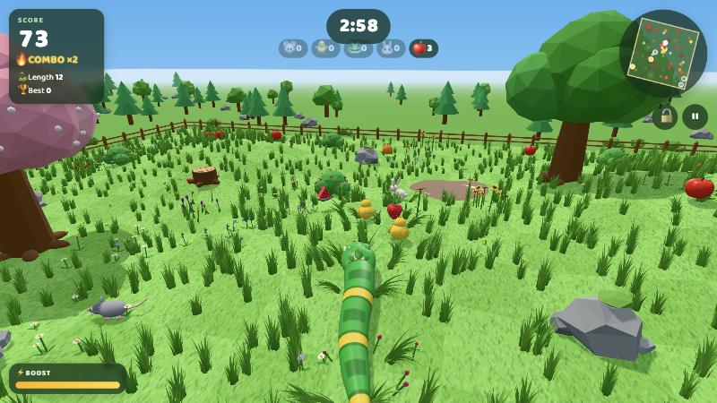

> The game speaks **Vietnamese and English** — switch with **VI / EN** in the top-right corner of the menu (or of the
> model library). The choice is remembered; on a first visit the game follows the browser language.
> The screenshots below show the English interface.

## Contents

- [Features](#features)
- [1. Installation](#1-installation)
- [2. Development](#2-development)
- [3. Build and deploy](#3-build-and-deploy)
- [4. How to play](#4-how-to-play)
- [5. Customization](#5-customization)
- [6. Sound](#6-sound)
- [7. 3D model library](#7-3d-model-library)
- [8. Troubleshooting](#8-troubleshooting)
- [9. Privacy](#9-privacy)

## Features

- 🎥 **Head control** with [MediaPipe Face Landmarker](https://developers.google.com/edge/mediapipe/solutions/vision/face_landmarker/web_js),
  running entirely on the player's device (WebAssembly + GPU), with a calibration screen and a keyboard fallback.
- 🐍 A snake that **only moves forward**, with a smooth, bending body that follows the terrain; 9 skins and 8 fun head styles.
- 🍎🐭 7 kinds of fruit and 4 animals that **run away**, combo multipliers, a 100‑point golden apple and an animated catch counter.
- ⛰️ An arena with hills, mud, rocks, stumps, big trees, berry bushes, and **grass and flowers that part** as the snake passes.
- 🗺️ 5 arena themes, a **night mode** (moon, stars, fireflies) and 4 camera views including **first person**.
- 🎵 Synthesized background music and sound effects with separate volume controls.
- 🏆 2/3/4/5‑minute rounds and a high-score table stored in the browser (localStorage).
- 🧩 Every 3D model is built in code (no external model files), plus a **model library** page to inspect each one.
- 🌐 Vietnamese / English interface, switchable at any time (even with a round paused).

---

## 1. Installation

### Requirements

| | |
| --- | --- |
| Node.js | **20.19+** or **22.12+** (required by Vite 8), with npm |
| Browser | A recent Chrome / Edge / Firefox / Safari with WebGL 2 |
| Webcam | Needed for head control (the game is fully playable with the keyboard without one) |
| Origin | **HTTPS** or **localhost** — browsers only allow camera access on secure origins |

### Steps

```bash
git clone https://github.com/<user>/big-snake.git
cd big-snake
npm install
```

`npm install` runs `scripts/copy-wasm.mjs`, which copies the MediaPipe WebAssembly runtime from `node_modules` into
`public/mediapipe/wasm` (the folder is recreated each time and is git-ignored).

The face model `face_landmarker.task` (~3.6 MB) is downloaded from Google Cloud Storage the first time a player turns
on the camera. To self-host it (for example on an internal network), put the file in `public/models/` and build with:

```bash
VITE_FACE_MODEL_URL=./models/face_landmarker.task npm run build
```

---

## 2. Development

```bash
npm run dev
```

Open the address Vite prints (`http://localhost:5173` by default, or the port in the `PORT` environment variable):

- `/` — the game
- `/models.html` — the 3D model library

### Scripts

| Command | What it does |
| --- | --- |
| `npm run dev` | Development server with hot reload |
| `npm run build` | Static production build into `dist/` |
| `npm run preview` | Serve the production build locally |
| `postinstall` / `predev` / `prebuild` | Copy the MediaPipe WASM runtime into `public/` automatically |

### Project layout

```
index.html, src/main.js     UI: menu (Play / Customize / Settings), calibration, HUD, pause, game over, records
src/game.js                 Three.js scene, game rules, cameras (near / far / top / first person), minimap
src/snake.js                Snake: trail-following movement, collisions, growing / shrinking, terrain following
src/prey.js                 Bobbing fruit and small-animal AI (wander, flee, avoid walls and obstacles)
src/world.js                Arena: hills, obstacles, mud, big trees, berry bushes, interactive grass and flowers, themes, night
src/headTracker.js          Webcam + MediaPipe Face Landmarker → filtered head angles
src/input.js                Keyboard, and mapping head angles → steer / boost / look up
src/storage.js              Settings and high scores (localStorage)
src/i18n.js                 Vietnamese / English UI text, t() / tr() helpers and the language switch
src/audio.js, src/music.js  Sound effects, volume buses, background music (a small step sequencer)
src/themes.js               Arena theme palettes and night lighting
src/preview.js              Live snake preview in the menu
src/particles.js            Particle effects
src/models/                 Procedural 3D models: snake, fruit, animals, flowers, trees, rocks, fence…
src/viewer/                 Model library page
scripts/copy-wasm.mjs       Copies the MediaPipe WASM runtime into public/
.github/workflows/          GitHub Pages deploy workflow
```

### Technical notes

- **Head pose**: the rotation part of MediaPipe's `facialTransformationMatrixes` is taken relative to the "looking
  straight" pose captured during calibration, converted to yaw / pitch / roll, then smoothed with a One Euro filter
  (steady when still, responsive when moving fast).
- **Interactive grass and flowers**: every frame the CPU writes a 128×128 "push field" from the snake's body, the
  animals and the fruit. The vertex shader samples it once per blade and bends the blade around its root, keeping
  its length. The grass is split into 4×4 chunks so the camera only draws what it can see.
- **Snake body**: a tube rebuilt every frame from the snake's trail; the skin patterns are drawn in the fragment shader.
- In development, `window.__game` (game page) and `window.__viewer` (model library) are exposed for poking around in the console.

---

## 3. Build and deploy

```bash
npm run build
npm run preview
```

`dist/` (~23 MB, mostly the WASM runtime) is a static site that works on any static host with **HTTPS**.
Vite uses `base: './'` (relative paths), so it works both at a domain root and in a sub-folder.

### GitHub Pages (workflow included)

`.github/workflows/deploy.yml` runs `npm ci` → `npm run build` → publishes `dist/` on every push to `main`.

1. Create an empty GitHub repository and push the code:

   ```bash
   git remote add origin https://github.com/<user>/big-snake.git
   git push -u origin main
   ```

2. Go to **Settings → Pages → Build and deployment → Source** and select **GitHub Actions** (one-time setup).
3. Watch the **Actions** tab. When it finishes, the game is live at `https://<user>.github.io/big-snake/`
   and the model library at `https://<user>.github.io/big-snake/models.html`.

After that, every push to `main` redeploys the site; you can also re-run it with **Run workflow** (workflow_dispatch).

### Other hosts

| Host | Settings |
| --- | --- |
| Netlify / Vercel / Cloudflare Pages | Build command `npm run build`, output directory `dist`, Node 20.19+ / 22.12+ |
| Netlify Drop (no Git needed) | Build locally, then drag the `dist/` folder onto https://app.netlify.com/drop |

> High scores and settings live in localStorage, so they are tied to each browser and each domain —
> moving to a new domain starts a fresh high-score table.

---

## 4. How to play

### 4.1. Main menu

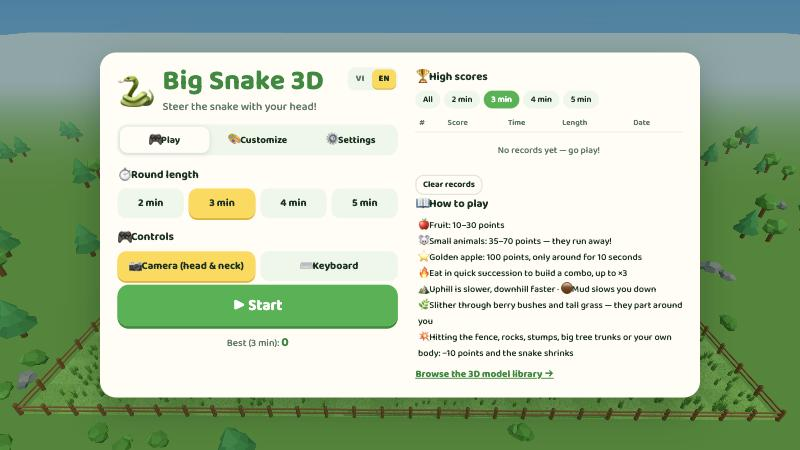

On the **🎮 Play** tab, choose the **round length** (2 / 3 / 4 / 5 minutes) and the **control method**
— 📷 Camera or ⌨️ Keyboard — then press **▶ Start** or Enter.
On the right are the **high-score table** (filtered by round length) and a short summary of the rules.
The other tabs are **🎨 Customize** (see [section 5](#5-customization)) and **⚙️ Settings** (camera view,
sound, head-control options). The **VI / EN** switch next to the title changes the language.

### 4.2. Camera calibration (head control)

1. Allow camera access when the browser asks.
2. Sit 50–80 cm from the screen with your face centred in the frame and well lit.
3. Look straight at the screen, press **🎯 Calibrate** and hold still for about a second.
4. Turn your head: the steering gauge should move **the same way** as your head. If it is reversed, press
   **⇄ Invert**. Nodding lights up the **⚡ BOOST** chip; raising your chin lights up the **👀 LOOK** chip.
5. Press **Play ▶** — a 3‑2‑1 countdown starts the round.

### 4.3. Controls

| Head (camera) | Keyboard | Action |
| --- | --- | --- |
| Turn head left / right (or tilt toward a shoulder — set in Settings) | `←` `→` / `A` `D` | Steer left / right |
| Nod the chin down slightly (> 12°) | `Space` / `Shift` / `↑` / `W` | Boost ×1.65 |
| Raise the chin (6°–18°) | Hold `↓` / `S` | Lift the camera to an overview |
| — | `C` | Cycle views: Near → Far → Top → First person |
| — | `L` | Lock / unlock the current view |
| — | `M` | Mute / unmute |
| — | `Esc` / `P` | Pause / resume |

Head angles under 3.5° are ignored so small jitters never steer the snake. **Sensitivity** (Settings, 1–10) sets how
far you must turn for a full-strength turn (34° down to about 12°). If the camera loses your face for more than
1.5 seconds the game **pauses automatically** and resumes when it sees you again.

### 4.4. Rules

The snake always moves forward and can never reverse. The more it eats, the longer and faster it gets
(5.4 → 7.6 units per second).

| Prey | Points | Growth | Notes |
| --- | --- | --- | --- |
| 🍎 Apple · 🍊 Orange | 10 · 12 | +1 | |
| 🍌 Banana · 🍓 Strawberry | 15 | +1 | |
| 🍇 Grapes | 20 | +2 | |
| 🍉 Watermelon | 30 | +3 | Rare |
| ⭐ Golden apple | 100 | +2 | Appears roughly every 20–40 s and disappears after 10 s |
| 🐥 Chick | 35 | +2 | Slow, flaps around in a panic |
| 🐭 Mouse | 40 | +2 | Fast, changes direction often |
| 🐸 Frog | 50 | +2 | Moves in hops |
| 🐰 Rabbit | 70 | +3 | The fastest and most alert — boost or corner it |

- **Combo**: catch prey within 2.6 seconds of each other to multiply points ×1.5, ×2, ×2.5, up to **×3**.
- **Boost**: once the ⚡ bar is empty it must recharge to 30% before it can be used again.
- **Terrain**: uphill is slower, downhill is faster; **mud** slows the snake by 40%; the snake can push straight
  through **berry bushes** and tall grass.
- **Crashing** into the fence, a boulder, a stump, a big tree trunk or your own body costs **−10 points**, makes the
  snake **20% shorter**, resets the combo and gives about 2 seconds of invulnerability. A round **always lasts the
  full time** you chose; the music speeds up for the last 20 seconds.

### 4.5. In-game HUD

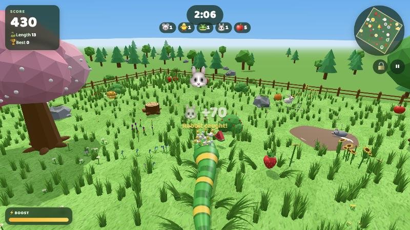

- **Top left**: score, combo, length and the best score for the current round length.
- **Top centre**: the countdown timer and the **catch counter** 🐭 🐥 🐸 🐰 🍎. When you catch an animal, a popup like
  "🐰 +70 · Rabbit caught!" appears, the animal's icon flies into its slot, and the slot bounces
  with a "ting".
- **Top right**: the minimap (rotates with the snake and shows trees, bushes, mud, rocks and prey), the 🔒 view-lock
  button and the ⏸ pause button.
- **Bottom left**: the camera preview (head control only) and the ⚡ boost bar.

### 4.6. Camera views

| First person | Top |
| --- | --- |
| 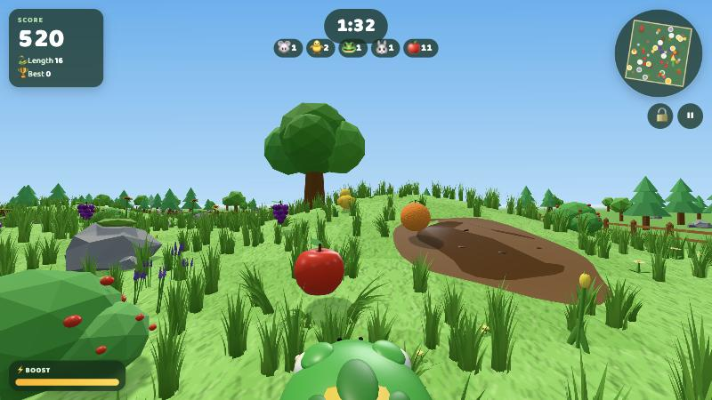 | 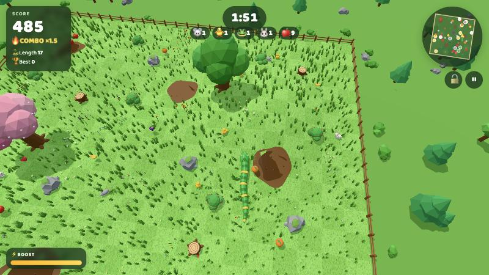 |

There are four views: **Near**, **Far**, **Top** and **First person** (camera just above the snake's head). Pick the
default in Settings or press `C` during play. Raise your chin to temporarily lift the camera for an overview.
**View lock** (`L` or the 🔒 button) freezes exactly the framing you currently see — even mid-overview — until you
unlock it.

### 4.7. Pausing and in-game settings

| Pause | Settings while paused |
| --- | --- |
| 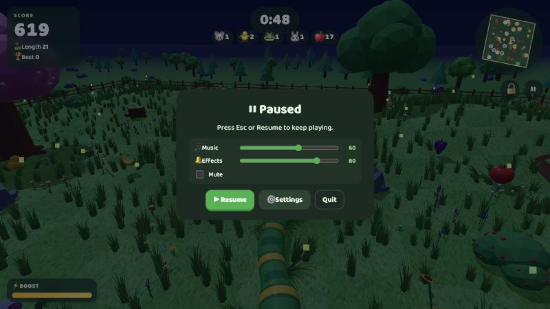 | 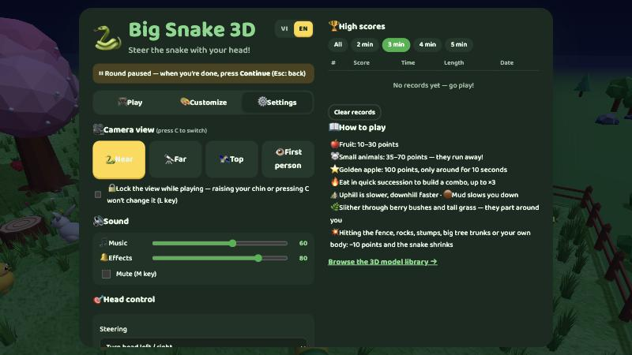 |

The pause screen has quick volume sliders, **🎯 Recalibrate**, **⚙️ Settings** and **Quit**. Settings opens the
full menu without losing the round (you can even switch the language there); press **▶ Continue** to get
a 3‑2‑1 countdown and carry on exactly where you left off (a new round length only applies from the next round).

### 4.8. Game over and high scores

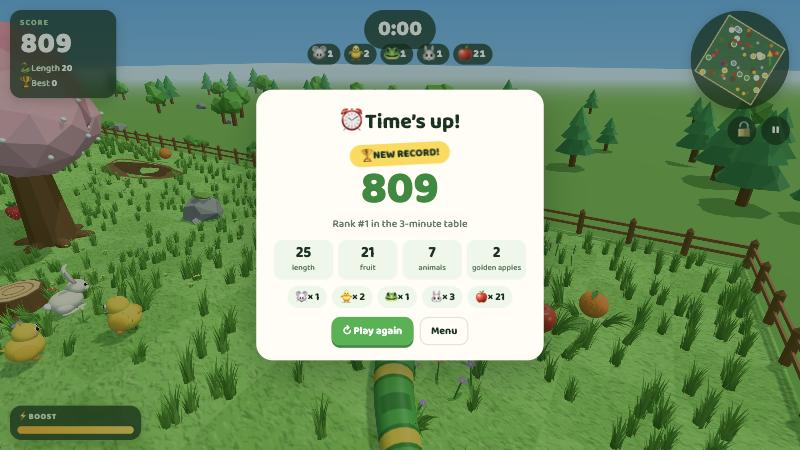

When time runs out you see your score, your rank for that round length (🏆 **NEW RECORD!** if you beat it), the final length, how many fruits, animals and golden apples you ate, and a breakdown per prey type.
The top 20 scores are kept for each round length; **Clear records** in the menu resets them.

---

## 5. Customization

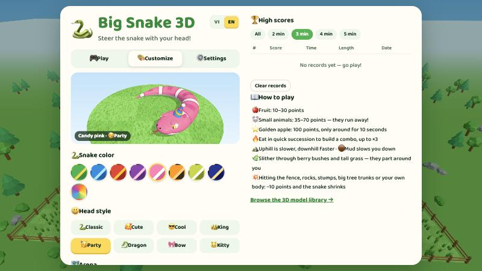

The **🎨 Customize** tab has a live 3D preview of your snake. Every choice is saved and can also be
changed while the game is paused.

### Snake skins and head styles

| 9 skins | 8 head styles |
| --- | --- |
| 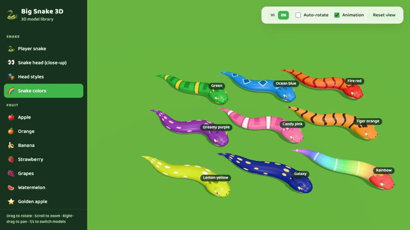 | 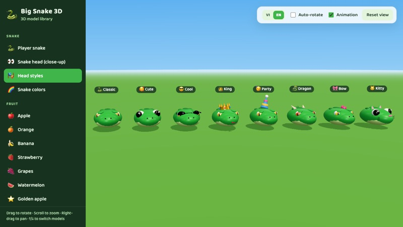 |

- **Skins**: Green (bands), Ocean blue (diamonds), Fire red and Tiger orange (stripes), Dreamy purple, Lemon yellow
  and Galaxy (spots), Candy pink (white bands), Rainbow.
- **Head styles**: Classic, Cute, Cool (sunglasses), King (crown), Party (party hat), Dragon (horns), Bow, Kitty.

### Arena themes

| Autumn | Winter |
| --- | --- |
| 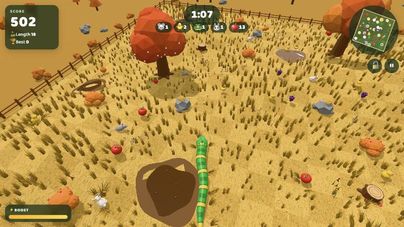 | 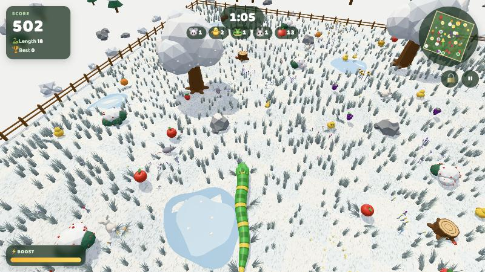 |
| **Desert** | **Candy land** |
| 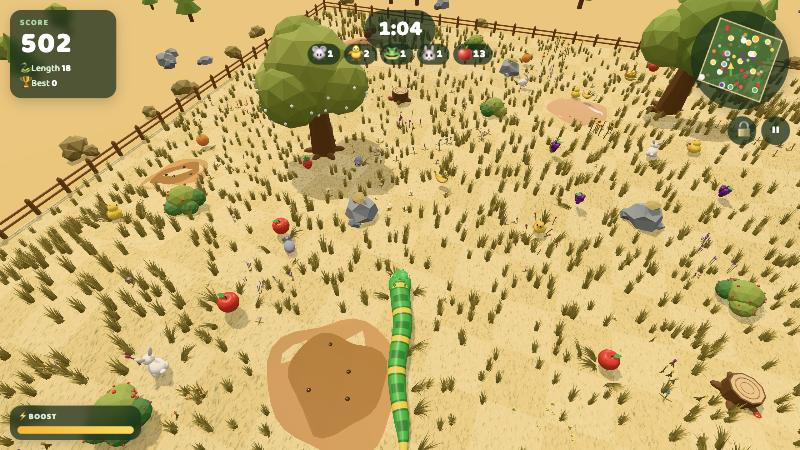 | 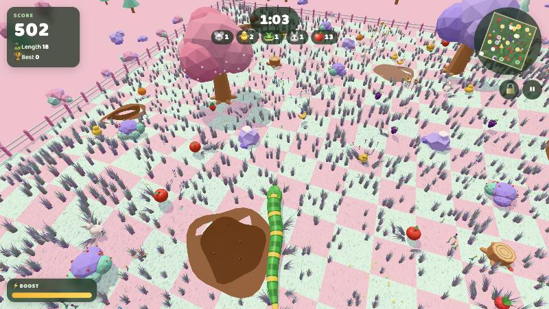 |

Together with **Meadow** (the image at the top) there are 5 themes. Each theme is a recolour table in `src/themes.js`.

### Light / dark mode

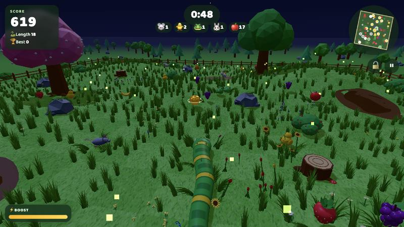

**☀️ Light / 🌙 Dark / 🖥️ System**: dark mode switches the UI to dark colours and turns the
arena into night with a moon, stars and fireflies. It works with every theme.

### Grass and flowers

| Slider | Range | Default |
| --- | --- | --- |
| 🌱 Blades (per clump) | 16–32 | 28 |
| 📏 Height | 50–200% | 100% |
| 🌾 Density (number of clumps) | 20–250% (100% = 2,600 clumps) | 100% |
| 🌿 Clump size | 50–200% | 100% |
| 🎲 Variety | 0–100% — higher means grass grows in random patches of different sizes | 50% |

There are 9 kinds of flowers (cosmos, daisy, tulip, sunflower, lavender, dandelion, bluebell, rose, buttercup). They
grow in clumps at random heights and lean aside when the snake passes. On slower machines, lower the density and the
blades per clump.

---

## 6. Sound

All sound is synthesized with the Web Audio API (`src/audio.js`, `src/music.js`); there are no audio files:

- **Music**: a gentle bell tune in the menu and an upbeat chiptune during play (faster in the last 20 seconds, ducked while paused).
- **Effects**: eating (pitch rises with the combo), a distinct cry for each animal when it flees, boost, mud splashes,
  rustling bushes, crashes, the golden apple appearing, the countdown, a "ting" when the catch counter goes up, and an
  end-of-round jingle.
- **Volume**: 🎵 Music and 🔔 Effects are set separately (Settings menu or pause screen); `M` mutes everything.

---

## 7. 3D model library

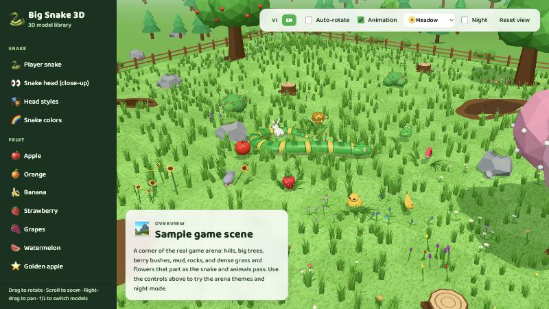

`models.html` lists every model in the game, with orbit / zoom controls and animations:

- **Snake**: the player snake, a head close-up, all head styles, all skins.
- **Fruit** and **small animals** (with points, flee speed and more).
- **Environment**: pine and round trees, big trees (oak, cherry blossom, apple), bushes and berry bushes, rocks and
  boulders, stumps, mud, every flower, grass clumps (16 / 24 / 32 blades side by side), the wooden fence.
- **Overview**: every prey side by side at true scale, and a **sample scene** — a corner of the real game arena with a
  snake weaving through the grass; pick the theme and toggle night mode from the toolbar.

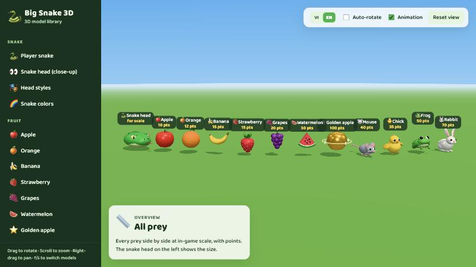

---

## 8. Troubleshooting

| Problem | Fix |
| --- | --- |
| "Camera unavailable" | Click the camera icon in the address bar to allow access, then **Retry**. The page must be served over `https://` or from `localhost`. |
| The camera is in use by another app | Close that app (Zoom, Meet…) and retry. |
| The snake turns the opposite way | Calibration screen → **⇄ Invert**, or Settings → Head control → **Invert steering**. |
| Steering feels too weak / too twitchy | Recalibrate while sitting straight; adjust **Sensitivity** in Settings. |
| The game keeps pausing itself | Your face is leaving the frame or the room is too dark — centre yourself and add light. |
| Low frame rate | Lower grass **Density** and **Blades per clump**; prefer the Near view over Top. |
| No sound | Click the page once (browsers block audio until the first interaction); check `M` and the volume sliders. |
| Grass / flowers pop in after loading or changing theme | The browser is compiling shaders; wait about a second. |

## 9. Privacy

Camera frames are processed **only on the player's device** (MediaPipe runs in the browser); no images or data are
sent anywhere. The only network downloads are the face-detection model and the web font. Settings and high scores
stay in the browser's localStorage.
